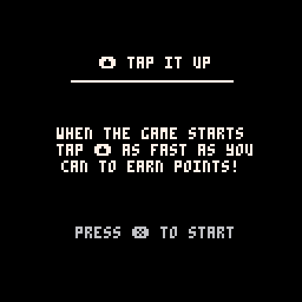
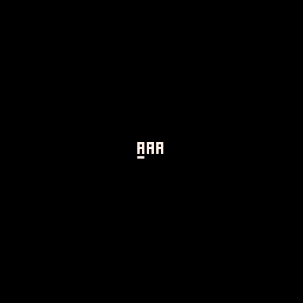
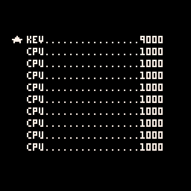

# HIGHSCORE
A simple library for storing, loading, and inputting high score records in your PICO-8 games.

<p align="center">
  
</p>

----------

## Installation

Clone this repo or download the files, then move them into the directory of the project you would like to include them in. Once you have them in your project, use `#include` statements to include the files you want. `highscore.lua` is always required.

After you've included the libraries you'd like to use, you'll need to call `cartdata` with the name of your cart to enable persistent storage.

```lua
#include highscore.lua
#include highscore.input.lua
#include highscore.table.lua
cartdata("my_game_v1")
```

----------

## About
This library is based on the high score implementation by [Paranoid Cactus](https://paranoidcactus.itch.io/) in [Lava Joe](https://www.lexaloffle.com/bbs/?tid=36418). It provides developers with a simple way to implement top ten score boards in arcade-like PICO-8 games.

I've tried to be concious of token usage, but also provide a friendly interface for managing high score records. The lirbary is also split into three separate files to give you the option of including just what you need. If you decide to implement your own input or table, the corresponding libraries in this project can act as example implementations.

If you see any opporutunities for token optimization, please open a pull request.

----------

## Libraries

### highscore.lua
This is the core `highscore` and is required if you want to also use `highscore.input.lua` or `highscore.table.lua`. This library provides the ability to store and load up to ten three character names and 16-bit numbers to cartdata.

#### highscore.init(memory_address?)
This will initialize the highscore libary and load any existing records from memory. By default, highscore will use 50 bytes of data starting at address `0x5e00`. `highscore.init` can be called with a specific memory address if you need to store score records in another location.

**Requirement**: Before you can initialize the `highscore` library, you need to call `cartdata` with your cart name.

```lua
#include highscore.lua
cartdata("example_game_v1")
highscore.init()

-- initialize with memory address
highscore.init(0x5e00)
```
#### highscore.add(name,score)
Add a three character name and 16-bit interger score to the highscore table. If the value of the score is less than the lowest score in the table, this function has no effect.

```lua
highscore.add("kev", 1000)
```

After a record is added successfully added, all records are stored to cartdata.

#### highscore.index(score)
Get the index where a given value would end up in the highscore table. This does not change the in memory highscore table, and it does not write to cartdata.

This method is useful for determining if a score would be added to the table so that you can accept user input, display a "new high score!" message, etc.

```lua
if highscore.index(1000) == 1 then
  print "you're the best!"
elseif highscore.index(1000) then
  print "new record!"
else
  print "better luck next time..."
end
```

#### highscore.reset()
Reset the region of cart data used to store highscore records. This could be called in a number scenarios: you've updated your game version, under various gameplay conditions, or as a menu item.

```lua
-- basic usage
highscore.reset()

-- menu item example
menuitem(1, "reset scores", highscore.reset)

-- use with add to populate default values
highscore.reset()
for i=1,10 do
  highscore.add("cpu",10)
end
```

#### highscore.records
Returns a table of the current highscore records. Each record is a table with a `name` and `score` key.

```lua
for record in all(highscore.records) do
  print record.name..": "..record.score
end
```

#### highscore.last_index
Return the last updated record index from the highscore table. This is useful for showing new high scores on an end screen, for example.

```lua
highscore.records -- {}
highscore.add("kev",1000)
highscore.last_index -- 1
```

----------

### highscore.input
A simple implementation of a three character name input.


<p align="center">
  
</p>

#### highscore.input.name
Return the current string value of the name.

```lua
highscore.input.name -- aaa
```

#### highscore.input.index
Return the current character index.

```lua
highscore.input.index -- 1
```

#### highscore.input.update()
Update the highscore input. This handles accepting up, down, left, and right inputs to select the index and character of the name input.

```lua
function _update()
  highscore.input.update()
end
```

#### highscore.input.draw(x?,y?)
By default this draws the input centered on the screen but you can pass `x` and `y` values to change the position.

```lua
function _draw()
  cls()
  highscore.input.draw()
end
```

----------

### highscore.table

A simple implementation of a high score table. Most developers will probably want to customize their score display, but if you just need simple scores, or want a placeholder until you customize, this should do the trick.

This table will show all the names and scores and place a star next to the last updated score.

<p align="center">
  
</p>

#### highscore.table.draw(x?,y?)

Draw the high score table to the screen. Be default the table will be centered but the `draw` function accepts `x` and `y` arguments for fine tuning the postition.

```lua
function _draw()
  cls()
  highscore.table.draw()
end
```

----------

### Example Game

A small example tapper game is available as a demonstration of implementing all three libraries.
